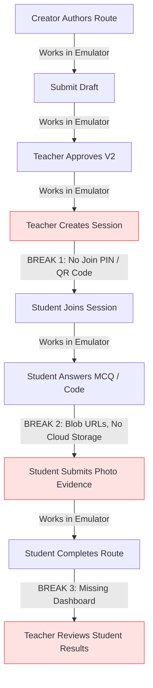

# TRAILIM — FULL MVP READINESS AUDIT

> **Audit Date**: September 2026  
> **Repository**: `C:\TrailimGit`  
> **Audited Branch**: `main` (`7b2b35c`, incorporating verified VS1 browser QA and closeout fixes from `qa/vs1-manual-browser-e2e`)
> **Scope**: Read-only product, architecture, backend, security, and multi-platform UX audit. No production deployment, no code modifications, no merges.

---

## Executive Summary

Trailim has achieved a mathematically rigorous, emulator-verified core domain engine for its Vertical Slice 1 (VS1):
- Immutable version snapshots, server-side transactions, protected answer key redaction, and server-authoritative scoring are **genuinely working** in Firebase Emulators.
- The browser E2E flow (Creator draft → Teacher review & change request → V2 resubmission → Approval → Session creation → Participant play & scoring → Mid-session resume → Back button) has been fully validated in a real browser.
- Trusted session completion (`completeParticipation` Cloud Function) and server-authoritative response status semantics (`manual_review` vs. `after_route` / `never` hidden feedback) have been implemented and verified end-to-end on `main`.

However, **Trailim is not yet ready for a real school pilot**. The application currently relies on a dual-reality architecture:
1. **Auth & Identity**: There is zero real authentication. The app operates exclusively via 4 hardcoded demo personas (`student-1`, `teacher-1`, `approver-1`, `guest`) authenticated via emulator-only dev tokens generated by a Cloud Function that explicitly throws errors in production.
2. **Storage & Media**: Media and photo evidence are 100% simulated using local browser `blob:` URLs and static Unsplash presets. Firebase Storage is not configured, has no security rules, and no upload infrastructure.
3. **Session Joining & Teacher Results**: There is no PIN/QR session join screen for students, and no dashboard for teachers to see student completions, scores, or submissions.
4. **Desktop Workspace Shell**: The desktop UI is literally trapped inside a simulated 410px mobile smartphone frame with a fake hardware camera notch, violating the core multi-platform principle (*Workspace-first on desktop, Field-first on mobile*).
5. **Discovery**: The Explore tab queries hardcoded `localStorage` mock data instead of Firestore approved routes.

---

## 1. Current Product Inventory

Every user-facing flow across the codebase is classified below by operational status and primary platform context:

| Context Legend | Definition |
| :--- | :--- |
| **FIELD / MOBILE** | Optimized for on-the-move, single-hand, high-contrast outdoor execution. |
| **WORKSPACE / DESKTOP** | Optimized for creation, multi-column authoring, review, and dense management. |
| **SHARED** | Context-adaptive flows functioning across both form factors. |

### 1.1 Participant Flows

| Flow | Operational Status | Primary Context | Evidence & Implementation Reality |
| :--- | :--- | :--- | :--- |
| **Discover Route** | **MOCK / SIMULATED** | SHARED | `ExploreView.tsx` calls `dataService.getFilteredAndRankedRoutes()` which queries `localStorage['trailim_routes_v1']` seeded with `mockRoutes`. Does not query Firestore approved routes. |
| **Route Detail** | **PARTIALLY WORKING** | SHARED | `RouteDetailView.tsx` reads from `dataService` or a versioned snapshot override. Likes and bookmarks persist only to `localStorage`. |
| **Pre-Start Briefing** | **REAL / WORKING** | FIELD / MOBILE | `RoutePreStartView.tsx` presents mode selection (`learning`, `challenge`, `community_tour`), safety notes, duration, and team name input. |
| **Join / Start Session** | **LOCAL / EMULATOR ONLY** | FIELD / MOBILE | `ActiveRouteContext.tsx` invokes `createRouteSession` / `joinRouteSession` Cloud Functions. Works in emulator with dev auth tokens, but has no manual session PIN/code entry. |
| **Station Presentation** | **REAL / WORKING** | FIELD / MOBILE | `StationView.tsx` and `ContentBlockRenderer.tsx` render headings, rich text, images, video, and audio player blocks cleanly. |
| **Route Navigation** | **MOCK / SIMULATED** | FIELD / MOBILE | `MapPlaceholder.tsx` renders static SVG dotted bezier curves with CSS pins. No real map library (Mapbox/Leaflet) is installed in `package.json`. |
| **Task Responses** | **REAL / WORKING** | FIELD / MOBILE | `TaskRenderer.tsx` supports multiple choice, enter code, and text responses. Synchronizes with server-side responses via `useEffect`. |
| **Task Scoring** | **LOCAL / EMULATOR ONLY** | FIELD / MOBILE | Evaluated by `submitTaskResponse` Cloud Function. Correctness, attempt tracking, and retry penalties are calculated on the server. |
| **Progress / Resume** | **REAL / WORKING** | FIELD / MOBILE | State restores seamlessly on page refresh from Firestore participation records or `localStorage`. |
| **Route Completion** | **REAL / WORKING** | FIELD / MOBILE | `RouteCompletionView.tsx` displays celebration confetti, total score, and time elapsed. Updates participation status to `completed`. |
| **QR / Passcode Trigger** | **PARTIALLY WORKING** | FIELD / MOBILE | Trigger validation is backed by server-side secrets, but the client camera scanner is simulated with a manual code input fallback (`TRAIL4`). |
| **Location / GPS Trigger** | **MOCK / SIMULATED** | FIELD / MOBILE | `PermissionContext.tsx` catches geolocation errors and sets simulated coordinates to Tel Aviv (`32.0853, 34.7818`). No distance geofencing verification. |
| **Photo / Media Task** | **MOCK / SIMULATED** | FIELD / MOBILE | `MediaUploader.tsx` uses `URL.createObjectURL(file)` or selects an Unsplash preset photo. No upload to cloud storage. |
| **Learning Mode** | **REAL / WORKING** | FIELD / MOBILE | Immediate/after-route answer feedback, explanations, and retry penalties operate correctly. |
| **Challenge Mode** | **PARTIALLY WORKING** | FIELD / MOBILE | Mode flag is isolated in session, but countdown timer and team rankings rely on mock local data (`LeaderboardView.tsx`). |

### 1.2 Creator Flows

| Flow | Operational Status | Primary Context | Evidence & Implementation Reality |
| :--- | :--- | :--- | :--- |
| **Route Creation** | **LOCAL / EMULATOR ONLY** | WORKSPACE / DESKTOP | `CreatorDashboardView.tsx` & `RouteBuilderContainer.tsx`. Initializes draft in Firestore under `/routes/{id}/drafts/current`. |
| **Route Editing** | **LOCAL / EMULATOR ONLY** | WORKSPACE / DESKTOP | Modifies route title, description, subject, grade level, and metadata in draft state. |
| **Station Editing** | **LOCAL / EMULATOR ONLY** | WORKSPACE / DESKTOP | Multi-step form allows adding/editing stations, instructions, estimated minutes, and tasks. |
| **Station Ordering** | **REAL / WORKING** | WORKSPACE / DESKTOP | Linear position reordering updates `position` indices. |
| **Map / Location Input** | **MOCK / SIMULATED** | WORKSPACE / DESKTOP | Coordinates are manually typed into text inputs; no interactive map pin placement. |
| **Media Attachments** | **MOCK / SIMULATED** | WORKSPACE / DESKTOP | Cover image and block media are external URL strings or local blob URLs; no file upload pipeline. |
| **Task / Question Authoring**| **REAL / WORKING** | WORKSPACE / DESKTOP | Station builder configures MCQ (with correct answer toggle), code entry, and reflection tasks. |
| **Save / Reload Draft** | **REAL / WORKING** | WORKSPACE / DESKTOP | Saves draft aggregate to Firestore subcollection `/stations` or `vs1WorkflowRepository`; reloads on mount. |
| **Submit for Review** | **LOCAL / EMULATOR ONLY** | WORKSPACE / DESKTOP | Calls callable `submitRouteDraft`. Extracts protected answers into `/answerKeys` and creates immutable `RouteVersion` snapshot. |
| **Revision Workflow** | **REAL / WORKING** | WORKSPACE / DESKTOP | Creator sees teacher feedback, checks off resolution checklist, edits draft, and resubmits. |
| **Versioning** | **REAL / WORKING** | WORKSPACE / DESKTOP | Resubmission creates `V2` snapshot in Firestore; `V1` snapshot remains untouched. |

### 1.3 Teacher Flows

| Flow | Operational Status | Primary Context | Evidence & Implementation Reality |
| :--- | :--- | :--- | :--- |
| **Review Queue** | **LOCAL / EMULATOR ONLY** | WORKSPACE / DESKTOP | `ReviewQueueView.tsx` lists pending reviews for hardcoded `'org-edu-1'` merged with local mock reviews. |
| **Exact-Version Preview** | **REAL / WORKING** | WORKSPACE / DESKTOP | Loads frozen `RouteVersion` and versioned stations snapshot, ensuring teacher evaluates submitted state. |
| **Request Changes** | **LOCAL / EMULATOR ONLY** | WORKSPACE / DESKTOP | Calls `requestRouteChanges` Cloud Function with feedback string, setting status to `changes_requested`. |
| **Feedback Management** | **REAL / WORKING** | WORKSPACE / DESKTOP | Review feedback persists in review document and renders in creator revision view. |
| **Version Approval** | **LOCAL / EMULATOR ONLY** | WORKSPACE / DESKTOP | Calls `approveRouteVersion` Cloud Function, sets `route.approvedVersionId` and marks version `approved`. |
| **Session Creation** | **LOCAL / EMULATOR ONLY** | WORKSPACE / DESKTOP | Creates `routeSessions/{sessionId}` permanently bound to the approved `RouteVersion`. |
| **Participation Monitoring**| **BROKEN / MISSING** | WORKSPACE / DESKTOP | **No live monitoring dashboard exists**. Teacher cannot view active participants, current station progress, or completion rates in real time. |
| **Participant Submission Review** | **MISSING** | WORKSPACE / DESKTOP | Review Queue only handles *route creation drafts*. There is no UI for teachers to view student *task responses* or submitted field photos. |
| **Manual Grading** | **MODELED BUT NOT IMPLEMENTED** | WORKSPACE / DESKTOP | Task response status `manual_review` is modeled, but there is no grading screen or point adjustment callable for teachers. |
| **Class / Team Management** | **MOCK / SIMULATED** | WORKSPACE / DESKTOP | `NewTeamModal.tsx` selects from hardcoded `MOCK_CLASSMATES` list; does not persist teams to Firestore. |

### 1.4 Institution / Admin Flows

| Flow | Operational Status | Primary Context | Evidence & Implementation Reality |
| :--- | :--- | :--- | :--- |
| **Organizations** | **LOCAL / EMULATOR ONLY** | SHARED | Firestore schema exists; provisioned only via `devSeedDatabase` (`org-edu-1`). No UI to create or manage schools. |
| **Memberships** | **LOCAL / EMULATOR ONLY** | SHARED | Rules enforce `isActiveMember` and `isTeacher`, but memberships are hardcoded in emulator seed function. No invitation or roster UI. |
| **Teams Collection** | **PARTIALLY WORKING** | WORKSPACE / DESKTOP | `FirestoreTeamRepository` exists, but the UI bypasses it and writes teams into local state. |
| **Permissions / Roles** | **PARTIALLY WORKING** | SHARED | Backend rules enforce security boundaries strictly. Frontend uses hardcoded capabilities on `mockUsers`. |
| **Classes / Cohorts** | **MISSING** | WORKSPACE / DESKTOP | No data entity or UI exists for classes, semesters, or student rosters. |
| **Institutional Management**| **MISSING** | WORKSPACE / DESKTOP | No administrative dashboard for district leaders or school principals. |

---

## 2. MVP Critical Path Break Analysis

The smallest viable school pilot consists of:
```
Teacher / Student Creator
  → Creates Route
  → Builds Stations & Tasks
  → Submits Route for Review
  → Teacher Reviews, Requests Changes, and Approves V2
  → Teacher Starts Active Session

Student Participant
  → Discovers / Joins Session via Code
  → Follows Route in Field
  → Answers Tasks & Submits Photos
  → Progress Persists Across Reloads
  → Completes Route

Teacher
  → Views Participant Results, Scores, and Photo Evidence
```

### Critical Path Breaks in Current Codebase



1. **Break 1 — Session Joining for Students**:
   - *Issue*: When a teacher starts a session, there is no join PIN (e.g. 6-digit code or direct QR code) displayed to students.
   - *Current Mechanism*: In `ActiveRouteContext.tsx` line 87, the app queries for *any active session in the organization* when a student clicks "Start Route" on a route detail screen. If two classes run concurrently, or if multiple sessions exist, routing is non-deterministic.
2. **Break 2 — Media / Evidence Persistence**:
   - *Issue*: Photo evidence tasks rely on `URL.createObjectURL(file)` in `MediaUploader.tsx`. These URLs are local to that specific browser tab.
   - *Consequence*: The student's photo cannot be viewed by the teacher on another device, and disappears upon tab close.
3. **Break 3 — Teacher Results & Submissions Dashboard**:
   - *Issue*: While student responses and scores are safely written to Firestore `/routeSessions/{id}/participations/{uid}/responses/{resId}`, **there is no screen in Trailim for the teacher to view session results**. The teacher cannot see who attended, who completed, what answers were submitted, or what photos were captured.
4. **Break 4 — Authentication & Account Provisioning**:
   - *Issue*: A real teacher and real students in a classroom cannot log in. The app has no login form and depends on `getDevCustomToken` in the Cloud Functions emulator.

---

## 3. Backend / Firebase Audit

### 3.1 Entity-by-Entity Technical Audit

| Entity / Concept | Source of Truth | Authority Model | Rules Status | Cloud Functions Status | Test Coverage | Known Gaps / Constraints |
| :--- | :--- | :--- | :--- | :--- | :--- | :--- |
| **Auth** | Firebase Auth Emulator | Trusted Dev Tokens | `signedIn()` helper checks `request.auth != null` | `getDevCustomToken` callable | Emulator unit tests | No real auth provider (Email/Password, Google, SAML). Fails in production. |
| **Organizations** | Firestore `/organizations` | Admin SDK only | Client write denied; read requires `isActiveMember` | Seeded in `devSeedDatabase` | Unit tests in `firestore.rules.test.mjs` | Hardcoded `'org-edu-1'`. No self-service school signup. |
| **Memberships** | Firestore `/memberships` | Admin SDK only | Client write denied; read requires active member / teacher | Seeded in `devSeedDatabase` | Unit tests in `firestore.rules.test.mjs` | Document ID must equal Auth UID. No invite or roster import. |
| **Teams** | Firestore `/teams` | Client write with validation | Strict rules on `validTeam` & `validTeamMember` | Client direct repository write | Unit tests in `firestore.rules.test.mjs` | UI `NewTeamModal` does not call `teamRepository`. |
| **Routes** | Firestore `/routes` | Hybrid (Title client-writable; workflow metadata server-only) | Strict rules: clients cannot alter status or version IDs | Cloud Functions update `latestSubmittedVersionId` & `approvedVersionId` | Unit tests in `firestore.rules.test.mjs` | List queries require composite indexes on `organizationId` + `updatedAt`. |
| **RouteDraft** | Firestore `/drafts` | Team Authoritative | Team members can write drafts and draft stations | Read by `submitRouteDraft` function | Unit tests in `firestore.rules.test.mjs` | Stations stored in subcollection; aggregate reconstructed on read. |
| **RouteVersion** | Firestore `/versions` | Immutable Server Snapshot | Client write completely denied; read gated by approval | Created atomically in transaction by `submitRouteDraft` | 10 unit tests in `versionReviewService.test.mjs` | 2–10 stations limit due to Firestore transaction write ceilings. |
| **AnswerKeys** | Firestore `/answerKeys` | Server-Only Secret | Read and write denied to ALL clients (including creator/teacher) | Written on submit; read on evaluation | Verified in security rules and functions tests | Client must supply protected payload at submit time; no draft secret storage. |
| **Review** | Firestore `/reviews` | Cloud Functions | Client write denied; teacher or creator can read | Created on submit; updated on request changes & approve | Verified in `versionReviewService.test.mjs` | Bound to exact `routeVersionId`. |
| **RouteSession** | Firestore `/routeSessions` | Cloud Functions | Client write denied; active org members can read | Managed by `sessionParticipationService.ts` | 21 unit tests in `sessionParticipationService.test.mjs` | Transitions are forward-only (`open` → `active` → `completed`). |
| **Participation** | Firestore `/participations` | Cloud Functions | Client write denied; student reads own; teacher reads all | Atomic join, progress updates, and trusted completion (`completeParticipation`) | Verified in functions tests & browser E2E | Deterministic ID `${sessionId}_${userId}` prevents duplicate joins. |
| **TaskResponse** | Firestore `/responses` | Cloud Functions | Client write denied; student reads own; teacher reads all | Evaluated in transaction by `submitTaskResponse` | Verified in functions tests | Deterministic doc ID `base64url([stationId, taskId])`. |
| **privateEvaluation** | Firestore `/privateEvaluation` | Cloud Functions | Student reads only if `completed` + `after_route`; teacher reads always | Stores server evaluation secrets | Verified in rules tests (42 rules tests) | Subcollection under TaskResponse. |
| **Scoring** | Server Transaction | Server Authoritative | Client cannot supply score | Formula: delta replacement with penalty deduction; server preserves score on complete | Verified in functions tests | Retry penalty calculated server-side. |
| **Retries / Idempotency** | Server Transaction | Server Authoritative | Checked against `attemptLimit` and `submissionsInFlightRef` | `submissionId` caching in transaction prevents replays | Verified in functions tests | Protects against rapid double-clicks and network retries. |
| **Reveal Policies** | Server Transaction | Server Authoritative | `immediate`: public response; `after_route`: hidden until completion; `never`: redacted | Server redacts `isCorrect`, `feedback`, `pointsAwarded` | Verified in Playwright E2E | UI shows neutral slate "Response submitted" when hidden; "Pending review" only for manual_review. |

### 3.2 Explicit Dependencies on Demo / Mock Artefacts

The application currently relies on the following hardcoded artifacts:
1. **Hardcoded User Personas**: `src/context/AuthContext.tsx` hardcodes `'student-1'`, `'teacher-1'`, `'approver-1'`, and `'guest'`.
2. **Hardcoded Organization ID**: `CreatorDashboardView.tsx` (line 35) and `ReviewQueueView.tsx` (line 49) hardcode `'org-edu-1'`.
3. **Hardcoded Team ID**: `functions/src/index.ts` hardcodes `'team-market-storytellers'`.
4. **Hardcoded Unlock Code**: `RouteBuilderContainer.tsx` hardcodes secret access code `'TRAIL4'`.
5. **Hardcoded Coordinates**: `PermissionContext.tsx`, `RouteBuilderContainer.tsx`, and `ExploreView.tsx` fallback to Tel Aviv center (`32.0853, 34.7818`).
6. **Local Storage Fallback Repositories**: `dataService.ts`, `vs1WorkflowRepository.ts`, and `vs1SessionRepository.ts` maintain parallel in-memory/localStorage state that masks Firebase errors when feature flags are toggled off.

---

## 4. Production Readiness: Local vs Real Users

| Capability | Status Locally / In Emulator | Status for Real Production Users | Required Action for Production Pilot |
| :--- | :--- | :--- | :--- |
| **Firebase Project** | Works with local emulators | **NOT CONFIGURED** (`.firebaserc` missing) | Create Firebase project, configure web app credentials, add `.firebaserc`. |
| **User Authentication** | Works via dev token callable | **BROKEN** (`devSeedDatabase` throws in prod) | Implement real Firebase Auth (Email/Password or Google Auth) with login/register UI. |
| **User Onboarding** | Personas pre-seeded in emulator | **MISSING** | Create user profile creation flow and organization join/invite mechanism. |
| **Organization Assignment** | Pre-bound to `'org-edu-1'` | **MISSING** | Implement organization creation by teacher/admin and join via school code. |
| **Firestore Rules** | Fully tested (42/42 unit tests pass) | **READY FOR DEPLOYMENT** | Run `firebase deploy --only firestore:rules`. |
| **Firestore Indexes** | Defined in `firestore.indexes.json` | **READY FOR DEPLOYMENT** | Run `firebase deploy --only firestore:indexes`. |
| **Cloud Functions** | Fully tested (31/31 unit tests pass) | **READY FOR DEPLOYMENT** (needs env vars) | Remove emulator checks from non-dev functions and run `firebase deploy --only functions`. |
| **Media / Storage** | Ephemeral `blob:` URLs | **COMPLETELY MISSING** | Configure Firebase Storage bucket, create `storage.rules`, integrate Firebase Storage SDK. |
| **Loading & Error States** | Handled with browser `alert()` | **NEEDS POLISH** | Replace intrusive `alert()` dialogues with toast notifications and inline error banners. |
| **Offline / Network Drops** | Relies on active connection | **UNTESTED ON HARDWARE** | Enable Firestore offline persistence in `firebaseClient.ts` (`enableIndexedDbPersistence`). |
| **Observability & Logging** | Console logs in browser | **MISSING** | Configure Firebase Crashlytics or structured Cloud Logging. |

---

## 5. Desktop Workspace Audit

> **Product Principle**: *Desktop / Laptop = creation, review, and management workspace.*

### 5.1 Current Desktop UX Deficiencies

1. **The Artificial Smartphone Shell**:
   - In `src/App.tsx` (lines 34–43), the entire application on desktop is constrained inside a fixed-width container:
     ```tsx
     <div className="w-full sm:w-[410px] md:w-[430px] h-full sm:h-[860px] ... sm:rounded-[48px] sm:border-[10px] sm:border-slate-800">
       {/* Hardware Notch / Camera Pill on Desktop */}
       <div className="hidden sm:flex absolute top-0 left-1/2 -translate-x-1/2 w-32 h-4 bg-slate-800 rounded-b-xl z-50 ...">
     ```
   - On a 24" or 27" monitor, educators and student creators are forced to author 10-station routes inside a 410-pixel column surrounded by empty black space, complete with a fake camera pill notch!
2. **Bottom Navigation on Desktop**:
   - The desktop view displays a mobile bottom navigation bar (`BottomNav.tsx`) pinned to the bottom of the phone frame, instead of a persistent desktop sidebar.
3. **Card Soup & Nested Modals**:
   - `CreatorDashboardView.tsx` stacks draft cards vertically with truncated text and tiny action icons.
   - `RouteBuilderContainer.tsx` uses a 5-step wizard cramped into the 410px viewport, requiring endless vertical scrolling to configure content blocks and question options.
4. **Teacher Review cramped in Modal**:
   - `ReviewQueueView.tsx` opens submitted versions inside a narrow overlay modal where previewing 4 stations requires scrolling up and down through accordion cards.

### 5.2 Required Desktop Workspace Architecture (Post-Audit Specification)

```
+---------------------------------------------------------------------------------------------------+
|  TRAILIM WORKSPACE (Desktop)                                          Elena Vance (Teacher) [v]   |
+-------------------+-------------------------------------------------------------------------------+
| [Nav Sidebar]     | Main Workspace Content Area (Fluid Width, Max 1400px)                         |
|                   |                                                                               |
| - Routes & Drafts | +---------------------------------------------------------------------------+ |
| - Review Queue    | | Route Editor: "Voices of the Old Market"                  [Save] [Submit] | |
| - Active Sessions | +-------------------+-------------------------------------------------------+ |
| - Class Teams     | | Station Outline   | Station Editor Panel                                  | |
| - Analytics       | |                   |                                                       | |
|                   | | 1. Market Gate    | - Title: Market Entrance Archway                      | |
|                   | | 2. Spice Bazaar   | - Instructions: Find the keystone inscription...      | |
|                   | | 3. Baker Vault    | - Content Blocks: [Image] [Text Block]                | |
|                   | | 4. Courtyard Check| - Tasks:                                              | |
|                   | |                   |   * MCQ: What year was the vault built?               | |
|                   | | [+ Add Station]   |     [x] 1884  [ ] 1912  [ ] 1948                      | |
|                   | +-------------------+-------------------------------------------------------+ |
+-------------------+-------------------------------------------------------------------------------+
```

- **Persistent Left Navigation**: Replace `BottomNav` on screens `>= 768px` with an expansive sidebar containing Routes, Reviews, Sessions, Teams, and Settings.
- **Master-Detail Route Builder**:
  - Left panel: Reorderable station outline list with drag handles and validation status indicators.
  - Center/Right panel: Rich content block and task editor with inline media previews.
- **Table-Based Review Queue**: Full-width data table showing submission timestamp, team name, station count, version tag, and quick-action review buttons.
- **Session Results Grid**: Live spreadsheet-style grid displaying student names, stations visited, points earned, and clickable links to view submitted photos.

---

## 6. Mobile Field Audit

> **Product Principle**: *Field-first on mobile. Experience & Navigate on Mobile.*

### 6.1 Field UX Evaluation

| Category | Evaluation | Current Finding | Field Risk |
| :--- | :--- | :--- | :--- |
| **Action Clarity** | **STRONG** | `StationView.tsx` shows current station number, instructions, content blocks, and task renderer sequentially. | Low cognitive load during movement. |
| **Touch Targets** | **STRONG** | Primary buttons have `p-3.5` to `p-4`, min-height 48px, rounded corners, and full-width mobile hitboxes. | Easy to tap with gloves or while walking. |
| **GPS / Geolocation** | **SIMULATED** | Browser `getCurrentPosition` is wrapped with a 5s timeout that falls back to hardcoded Tel Aviv coordinates. | **High**: In real field conditions with poor satellite lock, app fakes location instead of guiding user. |
| **Camera / QR Scanning** | **SIMULATED** | No live video frame decoder (e.g. ZXing or html5-qrcode). User is expected to type the passcode `'TRAIL4'`. | **Medium**: Manual passcode entry works reliably, but true QR scanning is absent. |
| **Station Progression** | **STRONG** | Next station unlocks automatically after task completion; linear progression is enforced. | Prevents skipping stations. |
| **Interruption / Reload** | **STRONG** | Active route progress is stored in `localStorage` and synced with Firestore. Hard reload restores exact station. | Resilient against browser crashes or accidental tab closes. |
| **Weak Network Handling** | **WEAK** | Any Cloud Function failure triggers a blocking browser `alert()`. No offline caching for stations or task queue. | **High**: If a student enters a cellular dead zone in a park, task submissions fail completely. |
| **Sunlight Readability** | **MODERATE** | Slate-900 background for container with white cards (`#FAF9F6`). Good contrast. | Dark mode / High-contrast toggle exists in Profile, but outdoor auto-brightness is not optimized. |
| **Permission Denials** | **PARTIALLY WORKING** | Modal politely explains why camera/location is needed, with fallback options. | Graceful degradation without crashing. |

---

## 7. UX and Product Gaps

1. **Exposed Persona Switcher in Header & Profile**:
   - The top header and profile view contain a button to switch between "Student (Maya)", "Teacher (Sarah)", and "Approver (David)". This is a developer test harness that is currently embedded directly in the end-user navigation.
2. **Confusing Role Boundaries**:
   - When logged in as student `student-1`, the bottom nav still shows the "Review Queue" tab if `canReviewSubmitted` is true or if clicked. The student can view the teacher review queue.
3. **Disjointed Session Launch Flow**:
   - To play a route, the teacher must start a session, but there is no screen that generates a Join Code (e.g. `TRL-8821`) for students. Students must independently navigate to Explore → Route Detail → Start Route.
4. **Duplicate Scoring Systems**:
   - `types/index.ts` defines `totalPoints`, `xp`, `accuracy`, and `badges`, whereas `types/vs1.ts` defines server-authoritative `score` based on task points and retry penalties. The profile displays mock XP that is never updated by actual field route completions.
5. **Self-Grading Assessment Modal**:
   - In `CreatorDashboardView.tsx` (lines 90–99), there is an "Assess & Grade Project" button on the creator's own routes, allowing a student to award themselves an "A (92/100)".

---

## 8. Data Model & Architecture Consistency

### 8.1 Specification vs Implementation Reality

| Layer | Contract Specification (`TRAILIM_ARCHITECTURE.md`) | Current Code Implementation | Consistency Status |
| :--- | :--- | :--- | :--- |
| **Route vs Version** | `Route identity != RouteVersion` | Implemented cleanly: `/routes/{id}` points to `/versions/{vid}`. | **CONSISTENT** |
| **Session vs Version** | `RouteVersion != RouteSession` | Implemented cleanly: `/routeSessions/{id}` is permanently bound to `approvedVersionId`. | **CONSISTENT** |
| **Answer Protection** | `Public route payload != protected answer keys` | Protected answers extracted to `/answerKeys/{taskId}` and denied to clients. | **CONSISTENT** |
| **Legacy vs VS1 Domain** | Clean VS1 domain types in `src/types/vs1.ts` | Legacy `Route` in `src/types/index.ts` has 60+ fields. Bidirectional adapters in `vs1Adapters.ts`. | **TECHNICAL DEBT** (Adapters must be maintained) |
| **Storage Paths** | `storage paths/visibility` never client-only | No Storage rules or storage paths exist in repository. | **GAP** |
| **Live Multi-Session** | Sessions support multiple participants | Implemented: participations keyed by `sessionId_userId`. | **CONSISTENT** |

---

## 9. Security & Privacy Audit

### 9.1 Security Rules Analysis (`firestore.rules`)

1. **Server-Authoritative Gates**:
   - Client writes to `/routeSessions`, `/routeSessions/{id}/participations`, and `/responses` are strictly `allow write: if false;`.
   - Client writes to `/reviews` and `/routes/{id}/versions` are strictly `allow write: if false;`.
   - Client access to `/answerKeys` is strictly `allow read, write: if false;`.
2. **Organization Isolation**:
   - `isActiveMember(organizationId)` correctly validates that the user possesses an active membership document in `/organizations/{orgId}/memberships/{uid}`.
3. **Participant Privacy**:
   - Students can only read their own participation and responses (`request.auth.uid == participantUserId`).
   - Teachers can inspect all participations in their organization's sessions.
4. **Private Evaluation Redaction**:
   - The `/privateEvaluation/record` document enforces reveal policy rules: students cannot read it until participation is `completed` AND policy is `after_route`.
5. **Security Gaps Identified**:
   - **No Storage Rules**: There is no `storage.rules` file in the repository. Once file uploads are implemented, student photo submissions must be protected so only the submitting student and organization teachers can read them.
   - **Null User Guard in Transition**: As fixed on `qa/vs1-manual-browser-e2e`, passing null `auth.uid` during login state transitions previously caused Firestore rules evaluation errors.

---

## 10. Test and QA Coverage

### 10.1 Automated Test Inventory

| Test Suite | File Location | Execution Command | Tests Passed | Target Area |
| :--- | :--- | :--- | :--- | :--- |
| **Firestore Security Rules** | `firestore.rules.test.mjs` | `npm.cmd run test:rules` | **42 of 42** | Document read/write permissions, role checks, answer key lockouts, draft edits, reveal policy gates. |
| **Cloud Functions Workflow** | `functions/test/versionReviewService.test.mjs` | `npm.cmd run test:workflow` | **10 of 10** | Draft submission, change requests, resubmission, version approval transactions. |
| **Cloud Functions Sessions** | `functions/test/sessionParticipationService.test.mjs` | `npm.cmd run test:workflow` | **21 of 21** | Session lifecycle, participation uniqueness, progress updates, response scoring, trusted `completeParticipation`. |
| **Domain Adapters Unit** | `src/services/vs1Adapters.test.ts` | `npx.cmd tsx --test ...` | **5 of 5** | Splitting legacy tasks into public snapshots and protected answer keys. |
| **Route Draft Converters** | `src/services/firebase/routeDraftConverters.test.ts` | `npx.cmd tsx --test ...` | **2 of 2** | Draft-to-Firestore and Firestore-to-draft entity conversions. |
| **Session Repository Unit**| `src/services/vs1SessionRepository.test.ts` | `npx.cmd tsx --test ...` | **5 of 5** | In-memory session tracking, join deduplication, response scoring formulas. |
| **Playwright Browser E2E** | `scratch/vs1-browser.spec.js` | `npx.cmd playwright test ...` | **2 of 2** | Complete browser flow: Creator → Review → Resubmit → Approve → Play → Resume → Complete. |

*Total Automated Tests on `main`: **87 of 87 passing**.*

### 10.2 Regression Gaps

1. **Root `package.json` Test Script**: Running `npm test` in the root fails (`Missing script: "test"`). Client TypeScript tests can only be run manually via `npx tsx --test`.
2. **Physical Device Validation**: GPS accuracy, battery consumption, outdoor screen glare, camera focus on QR stickers, and offline cellular handoff have **never been tested on physical hardware** (browser emulation only).

---

## 11. MVP Priority Backlog

A single, prioritized, evidence-based backlog to take Trailim to a successful pilot:

### P0 — Blocks Real Pilot (Must complete before any real classroom test)

| ID | Problem | User Impact | Evidence / Files | Proposed Direction | Scope | Requires Manual QA? | Execution Type |
| :--- | :--- | :--- | :--- | :--- | :--- | :--- | :--- |
| **P0-1** | **No Real Authentication / Login UI** | Real teachers and students cannot log into the app; app crashes in prod without dev emulator. | `src/context/AuthContext.tsx`, `functions/src/index.ts` | Implement Firebase Email/Password and Google Sign-In with clean login/signup screens. | **M** | **NO** | **AUTONOMOUS** |
| **P0-2** | **No Cloud Storage for Photos / Media** | Student photo evidence and route cover images are stored as ephemeral local blob URLs. | `src/components/common/MediaUploader.tsx`, `firebase.json` | Set up Firebase Storage SDK, upload files to `/organizations/{orgId}/evidence/`, add `storage.rules`. | **M** | **NO** | **AUTONOMOUS** |
| **P0-3** | **Missing Session Join Flow (PIN / QR)** | Students cannot easily join the teacher's active route session from their phones. | `src/components/route/RouteDetailView.tsx`, `ActiveRouteContext.tsx` | Add a 6-digit session PIN to `RouteSession` and a "Join via PIN" entry modal on the mobile home screen. | **M** | **YES** | **NEEDS MANUAL QA** |
| **P0-4** | **Missing Teacher Session Results View** | Teachers cannot see who completed the trail, scores, or submitted student photos. | `src/components/creator/CreatorDashboardView.tsx`, `src/services/firebase/` | Build a "Session Results" view displaying real-time participant progress and submitted responses. | **M** | **YES** | **NEEDS MANUAL QA** |
| **P0-5** | **Explore Tab Does Not Query Firestore** | Approved routes created in Firebase do not appear in the student Explore view. | `src/components/explore/ExploreView.tsx`, `src/services/firebase/` | Update `ExploreView.tsx` to query approved routes from Firestore when Firebase is enabled. | **S** | **NO** | **AUTONOMOUS** |
| **P0-6** | **Desktop Workspace Shell Foundation** | Desktop creators and teachers are trapped inside a 410px simulated phone frame with a camera notch. | `src/App.tsx`, `src/components/common/BottomNav.tsx` | Break desktop authoring, review, and session management out of the artificial 410px phone container into a responsive desktop shell with persistent navigation on screens >= 768px. | **L** | **YES** | **NEEDS PRODUCT DECISION** |

### P1 — Should Fix Before First External Pilot (Professionalism & Usability)

| ID | Problem | User Impact | Evidence / Files | Proposed Direction | Scope | Requires Manual QA? | Execution Type |
| :--- | :--- | :--- | :--- | :--- | :--- | :--- | :--- |
| **P1-1** | **Advanced Desktop Master-Detail Layouts** | Authoring 10 stations requires vertical accordion scrolling instead of master-detail columns. | `RouteBuilderContainer.tsx`, `ReviewQueueView.tsx` | Build station outline sidebar + center content editor master-detail view on desktop. | **M** | **YES** | **NEEDS PRODUCT DECISION** |
| **P1-2** | **Simulated Maps (No Real Map Library)** | Students and creators cannot see real geographical maps or trail paths. | `src/components/common/MapPlaceholder.tsx`, `package.json` | Integrate a lightweight real map library (Leaflet + OpenStreetMap) for station locations. | **M** | **YES** | **NEEDS MANUAL QA** |
| **P1-3** | **Simulated QR Camera Scanner** | Students cannot scan physical QR codes in the field; forced to type manual code. | `src/context/PermissionContext.tsx`, `StationView.tsx` | Integrate standard html5-qrcode video scanner for live camera QR detection. | **S** | **YES** | **NEEDS MANUAL QA** |
| **P1-4** | **Developer Persona Switcher in Header** | End-users see developer testing controls in the main UI bar. | `src/components/common/Header.tsx`, `ProfileView.tsx` | Hide persona switcher in production environments; expose only real user profile details. | **XS** | **NO** | **AUTONOMOUS** |

### P2 — Valuable But Can Wait (Pilot Follow-up)

| ID | Problem | User Impact | Evidence / Files | Proposed Direction | Scope | Requires Manual QA? | Execution Type |
| :--- | :--- | :--- | :--- | :--- | :--- | :--- | :--- |
| **P2-1** | **Offline Caching for Weak Cellular Areas** | App drops out if a student walks through a cellular dead zone in a park. | `src/services/firebase/firebaseClient.ts` | Enable Firestore IndexedDB offline persistence and service worker asset caching. | **M** | **YES** | **NEEDS MANUAL QA** |
| **P2-2** | **Teacher Manual Grading UI** | Teachers cannot award customized points to subjective text reflections or photos. | `src/components/review/`, `functions/src/sessionParticipationService.ts` | Add callable `gradeTaskResponse` and teacher grading cards for `manual_review` submissions. | **M** | **YES** | **NEEDS PRODUCT DECISION** |
| **P2-3** | **Classroom Rosters & Team Invites** | Teachers cannot pre-assign students into structured teams from a classroom roster. | `src/components/creator/NewTeamModal.tsx` | Implement class entity and roster-based team generator in Firestore. | **L** | **YES** | **NEEDS PRODUCT DECISION** |

### LATER — Explicitly Outside MVP

- Nationwide spontaneous route discovery ("Near Me" algorithms).
- Augmented Reality (AR) waypoint navigation.
- Live multiplayer GPS tracking on teacher maps.
- Marketplace, creator payments, and institutional licensing.
- AI automated route generation from historical documents.

---

## 12. Multi-Platform Product Documentation Alignment

### 12.1 Source-of-Truth Documentation Drift

Currently, `TRAILIM_PRODUCT.md` opens with:
> *"Trailim is a mobile-first place-based learning platform..."* (line 3)

This mobile-first framing has led developers to treat the entire application—including complex desktop authoring and review tools—as a mobile application wrapped in a phone simulator.

### 12.2 Proposed Documentation Modifications

To establish the architectural principle:
**"Field-first on mobile. Workspace-first on desktop. Create & Manage on Desktop → Experience & Navigate on Mobile."**

The following exact text updates are proposed for future document review:

#### Proposed Change for `TRAILIM_PRODUCT.md` (lines 2–7)
```markdown
## Product definition
Trailim is a multi-platform place-based learning ecosystem designed with two distinct, context-optimized form factors:
1. **Workspace-First on Desktop**: A spacious, multi-column authoring, review, and analytics workspace for teachers and student creator teams.
2. **Field-First on Mobile**: A focused, one-action-at-a-time, high-contrast field navigation and quest experience for students exploring physical locations.

## Strategic core
Create & Manage on Desktop → Experience & Navigate on Mobile. One backend, one canonical data model, one unified design system, tailored for context.
```

#### Proposed Change for `TRAILIM_ARCHITECTURE.md` (lines 31–33)
```markdown
## Platform & Form Factor Boundaries
- **Mobile Shell**: Direct viewport rendering, single-column field interface, camera/location triggers, offline field caching.
- **Desktop Shell**: Responsive fluid canvas with persistent left navigation sidebar, master-detail route authoring, table-based review queues, and live participant monitoring grids. Under no circumstances should the desktop web application render inside a simulated smartphone chassis.
```

---

## Final Synthesis & Review

### A. What Trailim Already Genuinely Has
- **Immutable Route Snapshots**: Cryptographically clean separation between mutable authoring drafts and frozen, reviewed route versions.
- **Protected Answer Security**: Server-only answer keys that are stripped from public payloads and cannot be inspected by students.
- **Server-Authoritative Scoring & Completion**: Atomic Firestore transactions that manage points, retry limits, attempt penalties, reveal policies, and trusted session completion (`completeParticipation`) without trusting client input.
- **Resilient Mid-Session Resumption**: Progress, station unlock state, and previous responses persist and restore accurately on refresh.
- **Comprehensive Backend & Browser Test Coverage**: 42 passing security rules unit tests, 31 passing Cloud Functions transaction tests, 12 unit tests, and 2 passing Playwright browser E2E tests (87 total).

### B. What Currently Looks Real But Is Demo / Mock / Local
- **User Authentication**: Looks like logged-in users, but is actually an emulator-only token generator cycling through 4 hardcoded demo users.
- **Media & Photos**: Looks like file attachments, but is actually ephemeral local browser blob URLs or Unsplash placeholders.
- **Mapping & Navigation**: Looks like interactive maps, but is actually static SVG illustrations with hardcoded Tel Aviv coordinates.
- **Explore Tab**: Looks like a live community feed, but queries static `mockData.ts` from `localStorage`.
- **Student Team Management**: Looks like team collaboration, but selects from hardcoded mock classmates without saving to Firestore.
- **Desktop Experience**: Looks like an app running on a laptop, but is literally rendered inside a 410px smartphone frame with a camera notch.

### C. Exact P0 Path to First Real School Pilot
1. **Implement Real Auth**: Add Firebase Email/Password & Google Sign-In with basic login and registration views (**P0-1**).
2. **Implement Cloud Storage**: Add Firebase Storage for student photo tasks and route cover images (**P0-2**).
3. **Add Session Join PIN**: Allow teachers to start a session and display a 6-digit PIN that students enter on their mobile devices to join (**P0-3**).
4. **Build Teacher Results Dashboard**: Create a simple dashboard where teachers can view connected students, current progress, scores, and photo submissions (**P0-4**).
5. **Connect Explore to Firestore**: Query approved versions directly from Firestore so published routes are visible to the school (**P0-5**).
6. **Desktop Workspace Shell Foundation**: Break desktop authoring, review, and session management out of the 410px phone chassis into a true responsive desktop workspace shell (**P0-6**).

### D. Best Tasks Codex / Autonomous Agent Can Complete Autonomously
- **P0-1 (Real Auth UI & Wiring)**: Standard Firebase Web Auth integration with login/signup views.
- **P0-2 (Firebase Storage Integration)**: Standard upload pipeline for `MediaUploader.tsx` with storage security rules.
- **P0-5 (Firestore Explore Query)**: Replacing `localStorage` query in `ExploreView.tsx` with `listApprovedRoutes()`.
- **P1-4 (Hide Dev Switcher in Prod)**: Gating dev personas behind `import.meta.env.DEV`.

### E. Items Requiring Human / Manual Field Validation
- Physical GPS tracking in an outdoor park or school campus with trees and urban canyons.
- Scanning printed physical QR codes using phone cameras under direct outdoor sunlight.
- Cellular signal loss behavior when walking between stations in a physical field test.
- Student ergonomic comfort holding a mobile phone during a 30-minute outdoor walking quest.

### F. Things We Should Explicitly NOT Build Yet
- **AI Route Generation**: High risk of hallucinating inaccurate historical or location facts.
- **Nationwide "Near Me" Discovery**: Useless until hundreds of vetted routes exist.
- **Augmented Reality (AR) Navigation**: Adds excessive complexity and battery drain without improving pedagogy.
- **Marketplace & Paid Content**: Distracts from core educational validation in schools.
- **Live Multiplayer Racing / Physics**: Unnecessary for structured field learning and adds socket infrastructure costs.
